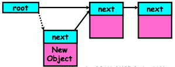

# cs162_OS_fa13_Berkeley
Berkeley CS 162 Operating System, Fall 2013, UC Berkeley

- fa 2013
    - [video fa13](https://www.youtube.com/watch?v=hry_qqXLej8&list=PLRdybCcWDFzCag9A0h1m9QYaujD0xefgM)
    - [web fa2013](https://inst.eecs.berkeley.edu/~cs162/fa13/)

- sp 2020
    - [viedo sp2020](https://www.youtube.com/watch?v=itfEcA3TXq4&list=PLIMsSuI81pxq7c91oQMpmXgmGICbuDA_c)
    - [video sp2020 yet another 7&14+](https://www.youtube.com/watch?v=dTl9QkH4j8o&list=PL6CdojO56mZ3SeRfpzMBMObSnTziA0gfE)
    - [video lecture 3](https://www.youtube.com/watch?v=Wj-Fvs7mMIQ&list=PL--jIyXjDXf6Q4XA6q8RYnyChYzJ0K0F2&index=3)
    - [video lecture 8 I/O, sockets, networking](https://www.youtube.com/watch?v=gxBvkr5JrXs&list=PL--jIyXjDXf6Q4XA6q8RYnyChYzJ0K0F2&index=4)
    - [web sp2020](https://inst.eecs.berkeley.edu/~cs162/sp20/)


## Homework 0

[RMS's gdb Debugger Tutorial](http://www.unknownroad.com/rtfm/gdbtut/gdbtoc.html)

<details>
<summary>
GDP practice
</summary>

```gdb
> gdb programname
(gdb) break main
(gdb) tbreak test.c:19 // temp break
(gdb) run arg1 "arg2" ...
(gdb) kill  // stop exec
(gdb) next   // step over
(gdb) x/s buf2  // examine variable
0x602080:	""
(gdb) disassemble
Dump of assembler code for function recur:
(gdb) si               // si/stepi , step into  machine instruction level
0x00000000004005d3	9	        return recur(i - 1);
(gdb) stepi
(gdb) info registers
rax            0x2	2
rbx            0x0	0
...

(gdb)info stack
(gdb)tbreak recurse.c:3 if i==0

or

(gdb) tbreak recurse.c:3
(gdb) condition  2 i==0
```
</details>


<details>
<summary>
C: to get the maximum number of process, file descriptors, and so on...
</summary>

```c
#include <sys/resource.h>
int getrlimit(int resource, struct rlimit *rlp);
```

```c
struct rlimit lim;

getrlimit( RLIMIT_STACK , &lim);
printf("stack size: %ld\n", lim.rlim_cur );

getrlimit( RLIMIT_NPROC , &lim);
printf("process limit: %ld\n", lim.rlim_cur);

getrlimit( RLIMIT_NOFILE , &lim);
printf("max file descriptors: %ld\n",  lim.rlim_cur);
```

</details>

- ELF (Executable and Linkable Format), the object format used by Linux
    - `gcc -C `  -> assemble code
    - `gcc -c `  -> obj code
    - `objdump -D `  disassemble all 
    - `objdump -t `  show symbol table 

- [objdump symbol table](http://manpages.ubuntu.com/manpages/focal/en/man1/objdump.1.html)


<details>
<summary>
Symbol Table Details
</summary>

```bash
SYMBOL TABLE:
00000000 l    df *ABS*	00000000 map.c
00000000 l    d  .text	00000000 .text
00000000 l    d  .data	00000000 .data
00000000 l    d  .bss	00000000 .bss
00000000 l    d  .note.GNU-stack	00000000 .note.GNU-stack
00000000 l    d  .eh_frame	00000000 .eh_frame
00000000 l    d  .comment	00000000 .comment
00000004       O *COM*	00000004 foo
00000000 g     O .data	00000004 stuff
00000000 g     F .text	00000052 main
00000000         *UND*	00000000 malloc
00000000         *UND*	00000000 recur
```

- COLUMN ONE: the symbol's value
- COLUMN TWO: a set of characters and spaces indicating the flag bits that are set on the symbol. There are seven groupings which are listed below:
    - group one: (l,g,,!) local, global, neither, both.
    - group two: (w,) weak or strong symbol.
    - group three: (C,) symbol denotes a constructor or an ordinary symbol.
    - group four: (W,) symbol is warning or normal symbol.
    - group five: (I,) indirect reference to another symbol or normal symbol.
    - group six: (d,D,) debugging symbol, dynamic symbol or normal symbol.
    - group seven: (F,f,O,) symbol is the name of function, file, object or normal symbol.
- COLUMN THREE: the section in which the symbol lives, ABS means not associated with a certain section
- COLUMN FOUR: the symbol's size or alignment.
- COLUMN FIVE: the symbol's name.

</details>


<details>
<summary>
<b>list_entry</b> macro: Converts pointer to list element LIST_ELEM into a pointer to the structure that LIST_ELEM is embedded inside
</summary>

```c
#define list_entry(LIST_ELEM, STRUCT, MEMBER)           \
        ((STRUCT *) ((uint8_t *) &(LIST_ELEM)->next     \
                     - offsetof (STRUCT, MEMBER.next)))

...

     struct foo
       {
         struct list_elem elem;
         int bar;
         ...other members...
       };

    struct list foo_list;
    list_init (&foo_list);      

...
                      
 struct list_elem *e; 
                      
 for (e = list_begin (&foo_list); e != list_end (&foo_list);
      e = list_next (e))                        
   {                  
     struct foo *f = list_entry (e, struct foo, elem);
     ...do something with f...                  
   }                  

```

`container_of` macro in linux kernel: [explain container_of](http://www.kroah.com/log/linux/container_of.html)

```c
#define container_of(ptr, type, member) ({                      \
        const typeof( ((type *)0)->member ) *__mptr = (ptr);    \
        (type *)( (char *)__mptr - offsetof(type,member) );})
```

Taking this container for example:

```c
struct container {
  int some_other_data;
  int this_data;
}
```

And a pointer int `*my_ptr` to the *this_data* member, you'd use the macro to get a pointer to `struct container *my_container` by using:

```c
struct container *my_container;
my_container = container_of(my_ptr, struct container, this_data);
```

</details>


## Lectures

1. TODO
2. [Lecture 2 Four Fundamental OS Concepts](lecture/2%20Four%20Fundamental%20Concepts%20of%20Operating%20Systems.pdf)
    - Four Fundamental OS Concepts(2.13)
        1. **Thread**
            - Threads are **virtual cores**.
            - Contents of virtual core (thread):(2.20)
                - PC,SP,registers
            - Where is Thread ?(2.20)
                - On the real (physical) core, or
                - Saved in chunk of memory - called the Thread Control Block (TCB)
            - **Each thread has its own TCB**.
                - Processes start out with **a** single main **thread**. 
                - The main **thread can** create new **threads** using a **thread fork** system call.
                - The new **threads can** also use this system call to create more **threads**.
            - How to switch threads?(2.21)
                - Saved PC, SP, ... in A thread's control block (memory)
                - Loaded PC, SP, ... from B's TCB, jumped to PC
        2. **Address space**
        3. **Process**
            - protected environment with multiple threads
            - code, data, files, ...
            - Where is kernel code/data in process ?(2.41)
                - unix: kernel space is mapped in high, but inaccessible to user processes.
            - PCB
                - Status (running, ready, blocked, ...)
                - Register state (when not ready)
                - Process ID (PID), User, Executable, Priority, ... 
                - Execution time, ...
                - Memory space, translation, ...
        4. **Dual mode operation / Protection**
            - **user mode** -> syscall, interrupt, exception, exit -> **kernel mode**
            - **kernel mode** -> rtn, rti, exec -> **user mode**
    - OS Bottom Line: Run Programs(2.14)
        1. Load instruction and data segments of executable file into memory
        2. **Create stack and heap**
        3. “Transfer control to program”
        4. Provide services to program, While protecting OS and program
    - Q: Do all threads get equal amount of time ?
        - Yes, no, maybe. It dependds a lot on what you're trying to do. It's a scheduling problem.
    - OS -> load program -> relocate
    - Q: Does kill the parent process killed the child ?
        - No. The process family are tree structured. If a parent dies before the child oftentimes the child gets inherited by a the **init** process (with pid 1 ).
    - Q: zombie process
        - when a process dies, it will leave a data struct called zombie to wait its parenet process to finish relative information garthing.
        - if the parent didn't invoide `wait()`, `waitpid()` to finish its work,  the zombie data will stay forever.

3. [Lexture 3 Process, syscall](lecture/3_Processes_cont_Fork_System%20Calls.pdf)
    - Two-stack model (3.33)
        - OS thread has interrupt stack (located in kernel memory) plus User stack (located in user memory)
        - Syscall handler copies user args to kernel space before invoking specific function (e.g., open)

4. [Lexture 4 Processes_cont_Threads_Concurrency](lecture/4_Processes_cont_Threads_Concurrency.pdf)
    - **socket** is an abstraction of network I/O
    - socket setup over TCP/IP
        - server socket: Listens for new connection, and produces new sockets for each unique connection.
        - that is, there is 3 sockets involved.
5. [Lecture 5 Concurrency and Mutual Exclusion](lecture/5_Concurrency.pdf)
    - all interrupts are asynchronous
    - A executing interrupt may be interrupted by another high priority interrupt. So there got to be several levels of interrupt stack.
    - **Kernel threads vs User Threads**
        - User threads and Kernel threads are exactly the same
        - A User thread is one that executes user-space code. But it can call into kernel space at any time. It's still considered a "User" thread, even though it's executing kernel code at elevated security levels.
        - A Kernel thread is one that **ONLY** runs kernel code and isn't associated with a user-space process.
        - In fact, all threads start off in kernel space, because the clone() operation happens in kernel space. (And there's lots of kernel accounting to do before you can 'return' to a new process in user space.)
    - User-Mode Threads
        - also called green thread
        - User program provides scheduler and htread package
        - May have serveral user threads per kernel thread
        - User threads may be scheduled non-preemptively (only switch on yield())
        - Cheap
    - Downside of user threads
        - When one thread blocks on I/O, all threads block
            - because I/O puts the kernel thread to sleep
        - Kernel cannot adjust scheduling among all threads
        - Option: Scheduler Activations
            - somehow, when you go into the kernel and go to sleep, the kernel is wise enough to pass up another kernel thread for you to use.
6. [6 Synchronization_locks_Semaphores](lecture/6_Synchronization_locks_Semaphores.pdf)
    - **Where** are we going with **synchronization**?
        Where | What
        --- | ---
        Programs |  Shared Programs
        Higher-level API | Locks, Semaphores, Monitors, Send/Receive
        Hardware | Load/Store, Disalbe Ints, Test`&`Set(most architecture), Compare`&`Swap
    - we're going to implement various higher-level synchronization primitives using atomic operations
        - everything is painful if only atomic primitives are load and store
        - need to provide primitives useful at user-level
    - Atomic Read-Modify-Write Instructions
        - atomic instruction sequences
        - These instructions read a value and write a new value atomically
        - Hardware is responsible for implementing this correctly
    - Examples of Read-Modify-Write
        ```c
        test&set (&address) {       /* most architectures */
            result = M[address];    // return result from “address” and    
            M[address] = 1;         // set value at “address” to 1
            return result;
        }
        compare&swap (&address, reg1, reg2) {   /* 68000 */
            if (reg1 == M[address]) {   // If memory still == reg1,
                M[address] = reg2;      // then  put reg2 => memory
                return success;
            } else {                    // Otherwise do not change memory
                return failure;
            }
        }
        ```
        - Each has different usage scenarios
    - Using of Compare&Swap for **queues**
        - Here is an atomic add to linked-list function
        ```c
        addToQueue(&object) {
            do {                //repeat until no conflict
                ld r1, M[root]  // Get ptr to current head
                st r1, M[object]  // Store the head of list into new object
            } until (compare&swap(&root,r1,object)); // unitl head pt is still pointing at the old guy
                                                     //   we quickly swap it in.
        }
        ```
        - 
            - the solid line from `New Object` to the 1st elment is what the `do` body done
            - the dotted line from root to `New Object` is compare&swap
    - Implementing **Locks** with test&set
        ```c
        int value = 0; // Free
        Acquire() {
           while (test&set(value)); // while busy
        }
        Release() {
            value = 0;
        }
        ```
        - **Busy-Waiting**: thread consumes cycles while waiting
            - For multiprocessors: every test&set() is a write, which makes value ping-pong around in cache (using lots of network BW)
        - Can we build test&set locks without busy-waiting?
            - Can’t entirely, but can minimize!

7. [7 7_Semaphores_Monitors_ReadersWriters](lecture/7_Semaphores_Monitors_ReadersWriters.pdf)
    - Semaphores
        - can be initialized as a non-negative integer
        - 2 operations:
            - P(): wait if zero; decrement when non-zero, 
                - P stands for 'proberen'(DUTCH) 尝试
            - V(): increment and wake a sleeping task(if exists)
                - V stands for 'verhogen'(DUTCH) 增加
        - from railway analogy
        - **Mutual Exclusion (initial value = 1)**
            - Also called "Binary Semaphore"
            - exactly behaving like locks that we talked about
            ```c
            semaphore.P();
            // Critical section goes here
            semaphore.V();
            ```
            - something like `sync.Mutex` in GO
        - **Scheduling Constraints (initial value = 0)**
            - allow thread 1 to wait for a signal from thread 2 
                - thread 2 **schedules** thread 1 when a given **event** occurs
                - it says, well, until some resource becomes available, we are able to sleep on this semaphore.
            ```c
            // example: suppose you had to implement ThreadJoin which must wait for thread to terminate
            Initial value of semaphore = 0
            ThreadJoin {
                semaphore.P(); // e.g. parent thread sleep
            }
            ThreadFinish {
                semaphore.V(); // e.g. child thread finish
            }
            ```
            - something like `channel` in GO
        - **Bounded Buffer implemented by Semaphores**
            ```c
            Semaphore fullSlots = 0; // Initially, no coke
            Semaphore emptySlots = bufSize; // Initially, num empty slots 
            Semaphore mutex = 1; // No one using machine

            Producer(item) {
                emptySlots.P();  // 1 Wait until space
                mutex.P();   // 2 Wait until machine free
                Enqueue(item);
                mutex.V();
                fullSlots.V(); // Tell consumers there is more cok
            }
            Consumer() {
                fullSlots.P(); // 1 Check if there’s a coke
                mutex.P();   // 2 Wait until machine free
                item = Dequeue(); 
                mutex.V();
                emptySlots.V();  // tell producer need more
                return item;
            }
            ```
        - Problem is that semaphores are dual purpose.
            - used for both mutex and scheduling constraints
            - the order of P's (statement 1 and 2 ) is important, exchanging them will cause deadlock. How do you prove correctness to someone?
        - Cleaner idea: use `lock` for mutual exclusion and `condition variables` for scheduling constraints.
    - Monitor (better than semaphore)
        - a **lock** and 0 or more **condition variables** for managing concurrent access to shared data
            - some languages like Java provide this natively
            - Most others use actual locks and condition variables
        - paradigm for concurrent programming !
        - Q: how do we change the consumer() routine to wait until something is on the queue ?
            - we could do this by keeping a count of the number of items on the queue(with semaphores), but error prone.
        - **Condition Variables**: a queue of **threads** waiting for something **inside** a critical section
            - key idea: allow **sleeping inside** critical section by **atomically release lock** at time we go to sleep.
            - CONTRAST to semaphores: semaphores can't wait inside critical section because you can not sleep with a lock (will cause deadlock)
                - But condition variables are very special items whose explicit use pattern is to sleep inside a critical section.
            - Operations:
                - **Wait(&lock)**: Atomically release lock and go to sleep.
                    - Re-acquire lock later, before returning
                - **Signal()**: wake up one waiter on the condition variable, if any
                - **Broadcast()**: wake up all waiters on the conditon variable
            - Rule: MUST hold lock when doing condition variable ops!
            - `sync.Cond` in golang
        - **Lock**: the lock provides mutual exclusion to shared data
            - Always acquire before accessing shared data structure
            - Always release after finishing with shared data
            - Lock initially free
        - Here is an (infinite) synchronized queue:
            ```c
            lock buf_lock; // Initially unlocked
            condition buf_CV; // Initially empty
            queue queue;

            Producer(item) {
                acquire(&buf_lock); // Get Lock
                enqueue(&queue,item); // Add item
                cond_signal(&buf_CV); // * Signal any waiters
                release(&buf_lock);   // Release Lock
            }

            Consumer() {
                acquire(&buf_lock);  // Get Lock

                // don't think about there ever being a point in which 
                //   you interacts without the lock at that point
                // nobody can be inside this critical section while I am.

                // why while loop ?
                //   when a thread is woken up by signal(), it is simply put on the ready queue
                //   another thread could be scheduled first and 'sneak in'
                //   need a loop to re-check condition on wakeup
                while (isEmpty(&queue)) {
                    cond_wait(&buf_CV, &buf_lock); // * If empty, sleep
                }
                item = dequeue(&queue);  // et next item
                release(&buf_lock);  // Release Lock
                return(item);
            }
            ```
        - Circular Buffer (Monitors, pthread-like)
            ```c
            lock buf_lock = <initially unlocked> 
            condition producer_CV = <initially empty> 
            condition consumer_CV = <initially empty>

            Producer(item) {
                acquire(&buf_lock);
                while (buffer full) { cond_wait(&producer_CV, &buf_lock); }
                enqueue(item);
                cond_signal(&consumer_CV);
                release(&buf_lock);
            }

            Consumer() {
                acquire(buf_lock);
                while (buffer empty) { cond_wait(&consumer_CV, &buf_lock); }
                item = dequeue();
                cond_signal(&producer_CV);
                release(&buf_lock);
                return item;
            }
            ```
    - Readers/Writers Problem
        - it's going to show the real power of the monitor programming paradigm.
        - using a single mutex lock is not efficient when there are many readers and less writers
        - Correctness Constraints:
            - Readers can access database when no writers
            - Writers can access database when no readers or writers
            - Only one thread manipulates state variables at a time
                - the state variables  are policy variables, they're the things that are going to be protected by the monitor lock.
        - `sync.RWMutex` in golang
    - Basic Monitor Structure
        ```c
        lock
        while (need to wait) {  // check and/or update state variables
            condvar.wait();     // wait if necessory
        }
        unlock

        do something so no need to wait

        lock
        condvar.signal(); // check and/or update state vars
        unlock
        ```
8. [Introduction to I/O Sockets Networking](lecture/8_Introduction_2_IO_Sockets_Networking.pdf)
    - kernel buffered reads/writes
        - always keep in mind when I write some data to a file it may still be memory in the kernel and not on disk.  So did a write system call doesn;t mean the data is permanent and you have to make sure that you do the right soft of flushing and syncing to make this work.
9. [Sockets Networking Con't](lecture/9_Sockets_Networking_Cont.pdf)


