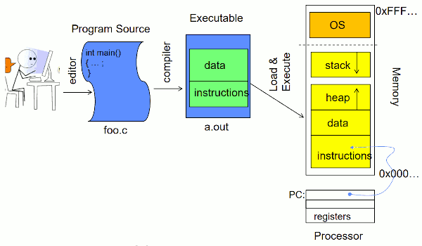

# Lecture 2 Four Fundamental OS Concepts

## Four Fundamental Concepts of Operating Systems

- **Thread: Execution Context**
    - Fully describes program state
    - Program Counter, Registers, Execution Flags, Stack
    - A virtual version of what you learned about in 61c
- **Address space (with or w/o translation)**
    - Set of memory addresses accessible to program (for read or write)
    - May be distinct from memory space of the physical machine (in which case programs operate in a virtual address space)
- **Process: an instance of a running program**
    - Protected Address Space + One or more Threads
- **Dual mode operation / Protection**
    - Only the “system” has the ability to access certain resources
    - Combined with translation, isolates programs from each other and the OS from programs

## OS Bottom Line: Run Programs

- Load instruction and data segments of executable file into memory
- Create stack and heap
- "Transfer control to program"
- Provide services to program
- While protecting OS and program

## First OS Concept: Thread of Control

- Thread: Single unique execution context
    - Program Counter, Registers, Execution Flags, Stack, Memory State
- A thread is **executing** on a processor (core) when it is **resident** in the processor registers
- Resident means: Registers hold the root state (context) of the thread:
    - Including program counter (PC) register & currently executing instruction
        - PC points at next instruction in **memory**
        - **Instructions stored in memory**
    - Including intermediate values in registers for ongoing computations
        - Can include actual values (like integers) or pointers to values **in memory**
    - Stack pointer holds the address of the top of stack (which is in memory)
    - **The rest is “in memory”**

- A thread is suspended (not executing) when its state is **not loaded** (resident) into the processor
    - Processor state pointing at some other thread
    - Program counter register **is not** pointing at next instruction from this thread
    - Often: a copy of the last value for each register stored in memory

